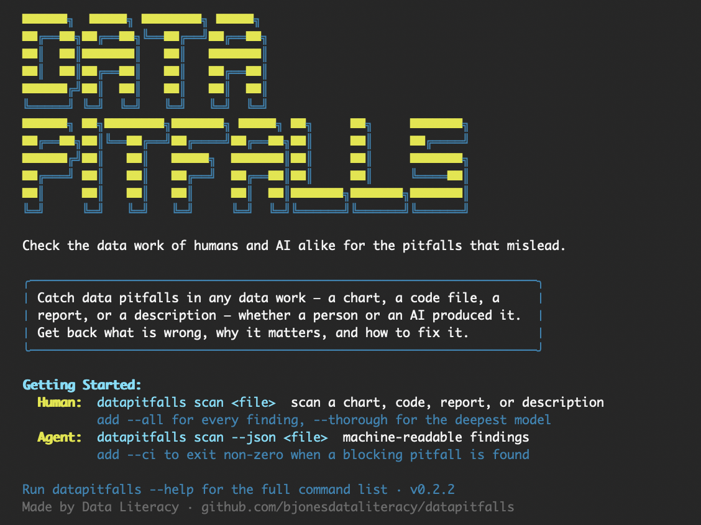

<div align="center">

# datapitfalls

### Helping you steer clear of common blunders when working with data

<picture>
  <source media="(prefers-color-scheme: dark)" srcset="docs/datapitfalls-cli-dark.png">
  <source media="(prefers-color-scheme: light)" srcset="docs/datapitfalls-cli.png">
  
</picture>

[](https://github.com/bjonesdataliteracy/datapitfalls/actions/workflows/ci.yml)
[](https://www.npmjs.com/package/datapitfalls)
[](LICENSE)
[](https://github.com/bjonesdataliteracy/datapitfalls/stargazers)
[](CONTRIBUTING.md)

</div>

---

## What is this?

**datapitfalls** is an open-source tool that detects the common blunders in your data work that trip up even seasoned practitioners — and its pitfall taxonomy spans the *entire* data reasoning chain, from the question you start with to the chart you finish with, not just the final pixels.

Most "chart linters" stop at the pixels: they'll tell you your axis is truncated or your colors fail a contrast check. That's useful, but it's a sliver of where data work actually goes wrong. The most consequential mistakes happen *upstream* — in how a question is framed, how data is collected, how it's transformed, how it's analyzed, and how the results are finally interpreted and communicated. A perfectly formatted chart built on a cherry-picked timeframe is still misleading. A flawless SQL query that silently drops nulls still lies.

Its pitfall catalog spans the whole chain:

> **question formulation → data collection → transformation → analysis → visualization → interpretation → communication**

It's powered by the [Claude API](https://www.anthropic.com/) and grounded in the pitfall taxonomy from the book [*Avoiding Data Pitfalls*](https://www.avoidingdatapitfalls.com) (Wiley) by Ben Jones. Give it a chart, a code snippet, a plain-English description of your analysis, or a whole report — and it returns a structured audit that names the pitfalls, explains *why* they matter, and tells you how to fix them.

Today you scan one piece at a time — a chart (or several together), a code snippet, a description, or a single document (a PDF report is read end-to-end, prose and charts alike). Detecting pitfalls across a connected, multi-stage workflow as one linked chain is on the [roadmap](ROADMAP.md).

This is not a style checker. It's a thinking partner for anyone who wants to work with data more honestly.

---

## The 8 Pitfall Domains

datapitfalls organizes every pitfall into one of eight domains — the pitfall categories from *Avoiding Data Pitfalls*. Together they span the full arc of a data project.

```
  ┌─────────────────────────────────────────────────────────────────────┐
  │                                                                       │
  │   1.  EPISTEMIC ERRORS        How we think about and know things      │
  │       └─ confirmation bias · anchoring · the streetlight effect ·     │
  │          precision/accuracy confusion · correlation ≠ causation       │
  │                                                                       │
  │   2.  TECHNICAL TRESPASSES    How data breaks in the pipeline         │
  │       └─ silent null drops · join explosions · type coercion ·        │
  │          encoding issues · pipeline failures                          │
  │                                                                       │
  │   3.  MATHEMATICAL MISCUES    How the numbers go sideways             │
  │       └─ % vs. percentage points · index-number misuse ·              │
  │          compounding errors · denominator blindness                   │
  │                                                                       │
  │   4.  STATISTICAL SLIP-UPS    How inference misleads                  │
  │       └─ Simpson's paradox · base-rate neglect · regression to the    │
  │          mean · multiple comparisons · sampling & survivorship bias   │
  │                                                                       │
  │   5.  ANALYTICAL ABERRATIONS  How analysis distorts                   │
  │       └─ cherry-picked timeframes · inappropriate aggregation ·       │
  │          apples-to-oranges comparisons · missing context             │
  │                                                                       │
  │   6.  GRAPHICAL GAFFES        How charts deceive                      │
  │       └─ truncated axes · misleading encodings · accessibility        │
  │          failures · chartjunk · dual-axis tricks · 3D distortion      │
  │                                                                       │
  │   7.  DESIGN DANGERS          How presentation fails the audience     │
  │       └─ poor layout · missing titles/labels · cluttered dashboards · │
  │          ignoring audience needs · form over function                 │
  │                                                                       │
  │   8.  BIASED BASELINE         Who has a voice in the data             │
  │       └─ unheard voices · undervalued contributions ·                 │
  │          misattributed credit · non-representative sources            │
  │                                                                       │
  └─────────────────────────────────────────────────────────────────────┘
```

---

## Quick Start

datapitfalls is designed around **four input modes**, so you can scan your work at whatever stage you're in.

> ⚠️ **Status:** The datapitfalls **detection engine is live**, and you can use it two ways. The **command line** scans chart images, code snippets, and plain-English descriptions (modes 1–3 below), with a `--ci` exit code for pipelines. A **web app** (in [`web/`](web/)) does all of that in the browser and adds **document upload** — PDF read natively (so Claude reviews the prose *and* the charts and tables), Word `.docx`, **PowerPoint `.pptx` decks**, Jupyter notebooks, and code files — plus **multi-chart scans** that compare several charts at once. The web app is per-IP rate-limited, and your input is sent to the Claude API to run the scan but isn't stored by the app. Install the CLI and engine with `npm install datapitfalls`, or run the web app locally with `cd web && npm run dev`. Still planned: a public site at [avoidingdatapitfalls.com](https://www.avoidingdatapitfalls.com) — see the [Roadmap](ROADMAP.md).

### 1. Scan a chart image

```bash
npx datapitfalls scan ./quarterly-revenue.png
```

Upload a chart and let Claude Vision flag truncated axes, misleading encodings, missing context, and accessibility issues.

### 2. Paste a code snippet (Python / SQL / R)

```bash
npx datapitfalls scan ./transform.sql
```

```sql
-- datapitfalls will flag the silent inner-join filtering below
SELECT u.id, o.total
FROM users u
JOIN orders o ON u.id = o.user_id;  -- users with no orders silently disappear
```

### 3. Describe an analysis in plain English

```bash
npx datapitfalls scan --text "We compared this year's signups to last year's, \
but only counted users who are still active today."
```

datapitfalls recognizes the survivorship bias hiding in that sentence.

### 4. Upload a report — or several charts at once (web app)

In the web app, drop in a **PDF report** and Claude scans the whole thing in context — the written claims *and* the charts and tables on the page (Word `.docx`, **PowerPoint `.pptx` decks**, Jupyter notebooks, and code files work too). Or add **several chart images** together for a multi-chart scan that catches pitfalls across them: inconsistent scales, inconsistent encodings, and contradictory messages.

---

## Installation

```bash
# Install as a project dependency
npm install datapitfalls

# …or run the CLI without installing
npx datapitfalls scan ./my-chart.png
```

You'll need a Claude API key from [Anthropic](https://console.anthropic.com/). Set it in your environment:

```bash
export ANTHROPIC_API_KEY="sk-ant-..."
```

> datapitfalls requires Node.js **18 or later**.

---

## How It Works

```
   ┌──────────────┐     ┌──────────────────┐     ┌──────────────┐     ┌──────────────────┐
   │  Your input  │ ──▶ │  Pitfall         │ ──▶ │  Claude API  │ ──▶ │  Structured      │
   │              │     │  taxonomy lookup │     │  analysis    │     │  pitfall report  │
   │  chart       │     │                  │     │              │     │                  │
   │  code        │     │  retrieve the    │     │  reason over │     │  pitfalls found, │
   │  description │     │  relevant rules  │     │  input +     │     │  severity, why   │
   │  document    │     │  from 8 domains  │     │  taxonomy    │     │  it matters, fix │
   └──────────────┘     └──────────────────┘     └──────────────┘     └──────────────────┘
```

1. **You provide input** — a chart, a code snippet, a description, or a document.
2. **Taxonomy lookup** — datapitfalls pulls the relevant pitfall rules from its catalog of eight pitfall domains.
3. **Claude API analysis** — Claude reasons over your input *and* the pitfall taxonomy, grounded in the knowledge from *Avoiding Data Pitfalls*.
4. **Structured pitfall report** — you get back a clear, prioritized list of pitfalls: what was found, how severe it is, why it matters, and how to fix it.

For the full technical picture, see [docs/ARCHITECTURE.md](docs/ARCHITECTURE.md).

---

## Based on the Book

datapitfalls is the software companion to [**_Avoiding Data Pitfalls: How to Steer Clear of Common Blunders When Working with Data and Presenting Analysis and Visualizations_**](https://www.avoidingdatapitfalls.com) by **Ben Jones** (Wiley, 2020).

The book distills two decades of teaching and practice into a map of where data work goes wrong — and that map is the foundation of this tool's pitfall taxonomy. Every rule datapitfalls applies traces back to a pitfall described in the book.

📘 Learn more at [avoidingdatapitfalls.com](https://www.avoidingdatapitfalls.com)

---

## Contributing

This project gets better with every pair of eyes on it. Whether you've found a bug, want to propose a brand-new pitfall rule, or want to improve the docs — you're welcome here.

- 🐛 [Report a bug](.github/ISSUE_TEMPLATE/bug_report.md)
- 💡 [Request a feature](.github/ISSUE_TEMPLATE/feature_request.md)
- 🕳️ [Propose a new pitfall rule](.github/ISSUE_TEMPLATE/new_pitfall_rule.md)

Read the [Contributing Guide](CONTRIBUTING.md) to get started, and please review our [Code of Conduct](CODE_OF_CONDUCT.md).

---

## Roadmap

datapitfalls is being built in the open, phase by phase. See the full [**Roadmap**](ROADMAP.md) to learn what's shipped, what's in progress, and what's coming next.

---

## License

datapitfalls is released under the [MIT License](LICENSE). © 2026 Ben Jones / Data Literacy, Inc.

---

## Credits

Created by [**Ben Jones**](https://dataliteracy.com) — author of *Avoiding Data Pitfalls*, founder of [Data Literacy, Inc.](https://dataliteracy.com), and data visualization instructor at the University of Washington.

Built with [Claude](https://www.anthropic.com/) by Anthropic.

<div align="center">

**If datapitfalls helps you work with data more honestly, please ⭐ the repo.**

</div>
